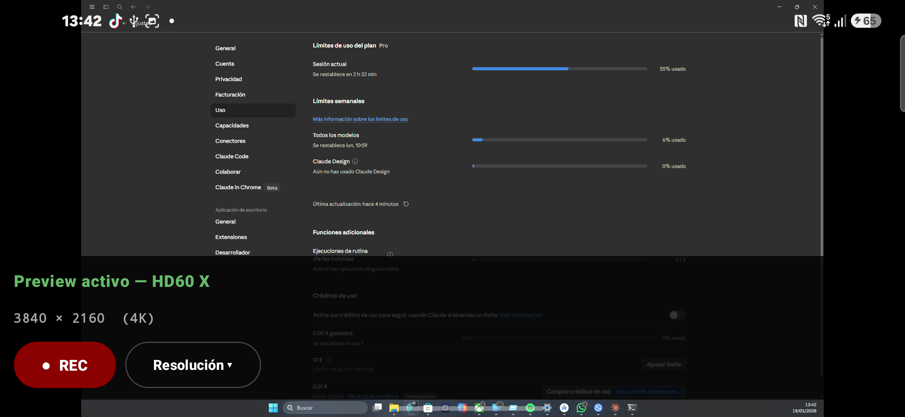
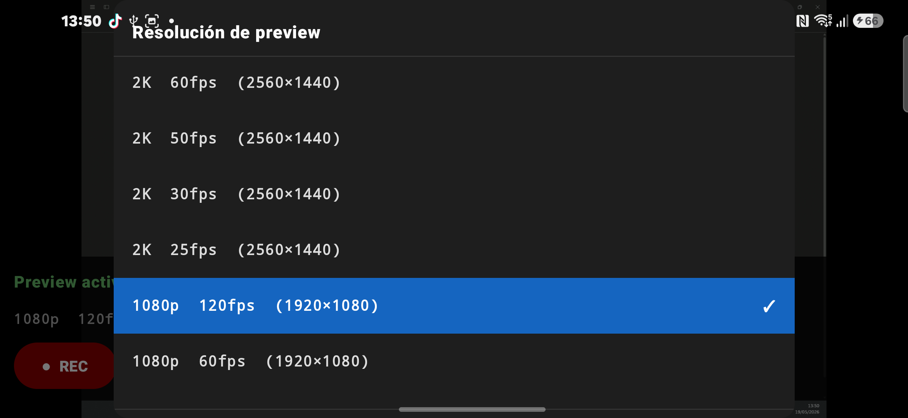
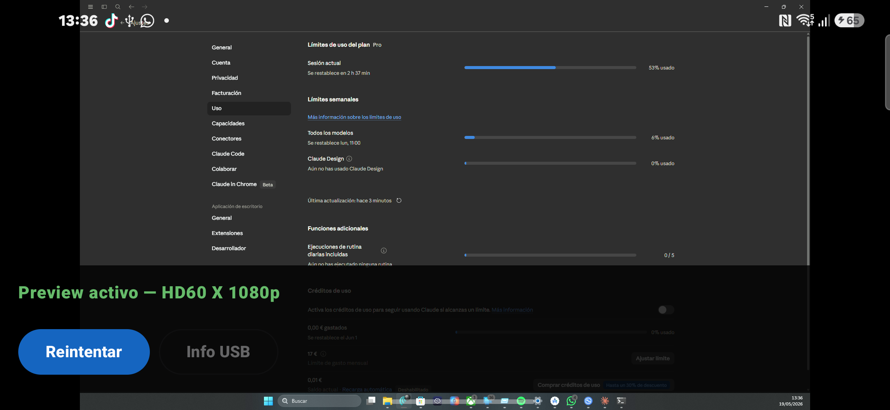

# ElgatoRecorder


An Android app that records video from an **Elgato HD60 X** capture card connected over **USB/UVC** — no Camera HAL involved. It talks to the device directly through [AUSBC](https://github.com/jiangdongguo/AndroidUSBCamera) 3.2.7 and implements a custom encoding pipeline:

```
NV21 frames (UVC preview callback) → MediaCodec (H.264) → MediaMuxer → MediaStore
```

AUSBC's built-in recorder relies on the MediaStore `_data` column, which is blocked on Android 10+ (scoped storage). This project bypasses that limitation by feeding raw NV21 frames into a hardware `MediaCodec` encoder and muxing directly into a `MediaStore`-provided file descriptor.

## Screenshots

| Recording UI | Resolution picker | Landscape preview |
|---|---|---|
|  |  |  |

## Features

- **Dynamic resolution detection** — parses the raw USB UVC descriptors (`VS_FRAME_MJPEG` / `VS_FRAME_UNCOMPRESSED` / frame-based) to discover every resolution and frame rate the device actually supports, instead of hardcoding a list.
- **H.264 recording to MediaStore** — hardware-encoded video written straight to a `MediaMuxer(FileDescriptor)` backed by MediaStore, compatible with Android 10+ scoped storage without legacy storage permissions.
- **Real-time preview** — live UVC preview rendered on a `TextureView`, including 4K modes with USB bandwidth tuning.
- **Jetpack Compose UI** — Material 3 interface with recording timer, resolution picker, and USB connection state, driven entirely by `StateFlow`.
- **Elgato-aware USB handling** — detects devices by Elgato/Corsair vendor ID (`0x0FD9`, any product ID) and manages the USB permission flow.

## Architecture

MVVM with unidirectional data flow. UI state lives in `StateFlow`s exposed by the ViewModel; UI events are forwarded to the camera layer through a `SharedFlow` command channel.

| Component | Responsibility |
|---|---|
| `MainViewModel` | Single source of truth: app state machine (`AppState`), available/current resolution, recording state and timer, and a `SharedFlow<CameraCommand>` channel that decouples Compose UI from the camera fragment. |
| `ElgatoCameraFragment` | Extends AUSBC's `CameraFragment`. Hosts the UVC preview (`AspectRatioTextureView`), configures MJPEG capture and USB bandwidth, collects commands from the ViewModel, and feeds preview frames to the recorder. |
| `VideoRecorder` | Standalone recording pipeline: NV21 → NV12 conversion, `MediaCodec` H.264 encoding (10 Mbps), `MediaMuxer` writing to a MediaStore file descriptor, with a bounded frame queue on a dedicated `HandlerThread`. |
| `UsbDeviceManager` | USB device discovery and permission flow. Exposes the connected Elgato device and permission result as `StateFlow`s via broadcast receivers for attach/detach events. |
| `UvcDescriptorParser` | Reads raw USB descriptors over a temporary connection (claiming no interface) and parses UVC class-specific videostreaming descriptors into `(width, height, fps list)` formats. |

## Tech Stack

- **Language:** Kotlin (coroutines + Flow)
- **UI:** Jetpack Compose, Material 3
- **USB/UVC:** [AUSBC](https://github.com/jiangdongguo/AndroidUSBCamera) 3.2.7 (`libausbc`)
- **Encoding:** MediaCodec (H.264/AVC), MediaMuxer, MediaStore
- **Architecture:** MVVM, `StateFlow`/`SharedFlow`, single-activity with a Compose-hosted camera fragment
- **Build:** Gradle Kotlin DSL, version catalog, compileSdk 36

## Getting Started

### Prerequisites

- Android Studio (current stable) with **Android SDK 36**
- A device with USB OTG/host support (the app targets arm64-v8a)
- An Elgato HD60 X (or other Elgato UVC capture device) plus a USB-C data cable

### Build

```bash
git clone <this-repo>
cd ElgatoRecorder
./gradlew assembleDebug
```

Install the APK, plug the capture card into the phone's USB-C port, and grant the USB permission when prompted.

## Known Limitations

This is a working prototype, documented warts and all:

- **No audio recording yet.** The pipeline currently muxes video only; AAC audio capture from the UVC device is the main documented blocker (see `docs/bugs/BUG-02` and `docs/mejoras/MEJORA-01`).
- Selected resolution is not persisted across sessions.
- Some AUSBC internals are accessed via reflection, which is fragile across library versions.

The full, honest list of known bugs and planned improvements (severity, effort estimates, proposed fixes) lives in [`docs/`](docs/README.md) (in Spanish).

## License

[MIT](LICENSE) — Copyright (c) 2026 Gerard Alvear
